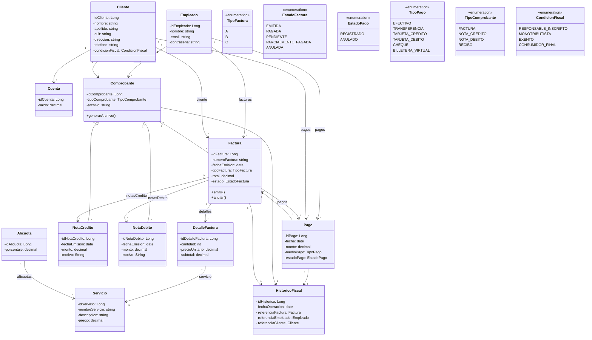

```mermaid
classDiagram

class Empleado {
  -idEmpleado: Long
  -nombre: string
  -email: string
  -contraseña: string
}

class Cliente {
  -idCliente: Long
  -nombre: string
  -apellido: string
  -cuit: string
  -direccion: string
  -telefono: string
  -condicionFiscal: CondicionFiscal
}

class Cuenta {
    -idCuenta: Long
    -saldo: decimal
}

class Servicio {
  -idServicio: Long
  -nombreServicio: string
  -descripcion: string
  -precio: decimal
}

class Alicuota {
    -idAlicuota: Long
    -porcentaje: decimal
}

class Factura {
  -idFactura: Long
  -numeroFactura: string
  -fechaEmision: date
  -tipoFactura: TipoFactura
  -total: decimal
  -estado: EstadoFactura
  +emitir()
  +anular()
}

class NotaCredito {
    -idNotaCredito: Long
    -fechaEmision: date
    -monto: decimal
    -motivo: String
}

class NotaDebito {
    -idNotaDebito: Long
    -fechaEmision: date
    -monto: decimal
    -motivo: String
}

class TipoFactura {
    <<enumeration>>
    A
    B
    C
}

class EstadoFactura {
    <<enumeration>>
    EMITIDA
    PAGADA
    PENDIENTE
    PARCIALMENTE_PAGADA
    ANULADA
}

class DetalleFactura {
  -idDetalleFactura: Long
  -cantidad: int
  -precioUnitario: decimal
  -subtotal: decimal
}

class Pago {
  -idPago: Long
  -fecha: date
  -monto: decimal
  -medioPago: TipoPago
  -estadoPago: EstadoPago
}

class EstadoPago {
    <<enumeration>>
    REGISTRADO
    ANULADO
}

class TipoPago {
    <<enumeration>>
    EFECTIVO
    TRANSFERENCIA
    TARJETA_CREDITO
    TARJETA_DEBITO
    CHEQUE
    BILLETERA_VIRTUAL
}

class Comprobante {
  -idComprobante: Long
  -tipoComprobante: TipoComprobante
  -archivo: string
  +generarArchivo()
}

class TipoComprobante {
    <<enumeration>>
    FACTURA
    NOTA_CREDITO
    NOTA_DEBITO
    RECIBO
}

class CondicionFiscal {
  <<enumeration>>
  RESPONSABLE_INSCRIPTO
  MONOTRIBUTISTA
  EXENTO
  CONSUMIDOR_FINAL
}

class HistoricoFiscal {
- idHistorico: Long
- fechaOperacion: date
- referenciaFactura: Factura
- referenciaEmpleado: Empleado
- referenciaCliente: Cliente
}

%% Relaciones
Empleado "1" --> "*" Factura : facturas
Empleado "1" --> "*" Pago : pagos
Empleado "1" --> "*" Comprobante : comprobantes 

Cliente "1" --> "1" Cuenta
Cliente "1" --> "*" Factura : cliente
Cliente "1" --> "*" Pago : pagos
Cliente "1" --> "*" Comprobante  

Factura "1" --> "*" DetalleFactura : detalles
DetalleFactura "*" --> "1" Servicio : servicio

Factura "1" --> "*" Pago : pagos
Pago "*" --> "1" Factura
Pago "1" --> "1" HistoricoFiscal

Comprobante "1" <|-- "*" Factura
Comprobante "1" <|-- "*" NotaCredito
Comprobante "1" <|-- "*" NotaDebito
Comprobante "1" --> "1" HistoricoFiscal

Factura "1" --> "*" NotaCredito : notasCredito
Factura "1" --> "*" NotaDebito : notasDebito
Factura "1" -->  "1" HistoricoFiscal

Alicuota "1" --> "*" Servicio : alícuotas

```