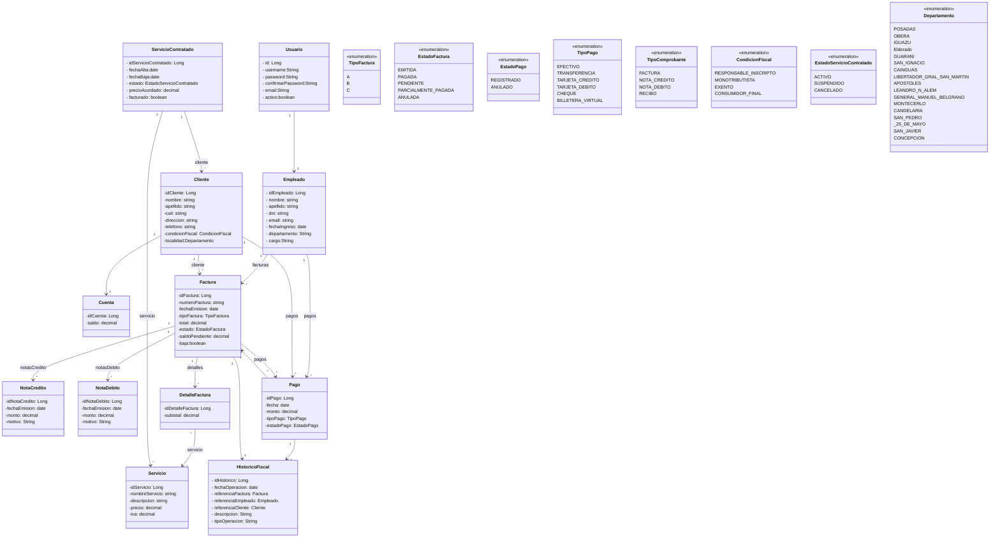

```mermaid
classDiagram

class ServicioContratado{
 
   - idServicioContratado: Long
   - fechaAlta:date
   - fechaBaja:date
   - estado: EstadoServicioContratado 
   - precioAcordado: decimal
   - facturado: boolean
}

class Usuario {
    - id: Long
    - username:String
    - password:String
    - confirmarPassword:String 
    - email:String 
    - activo:boolean
}


class Empleado {
  - idEmpleado: Long
  - nombre: string
  - apellido: string
  - dni: string
  - email: string
  - fechaIngreso: date
  - departamento: String
  - cargo:String
}

class Cliente {
  -idCliente: Long
  -nombre: string
  -apellido: string
  -cuit: string
  -direccion: string
  -telefono: string
  -condicionFiscal: CondicionFiscal
  -localidad:Departamento
}

class Cuenta {
    -idCuenta: Long
    -saldo: decimal
}

class Servicio {
  -idServicio: Long
  -nombreServicio: string
  -descripcion: string
  -precio: decimal
  -iva: decimal
}

 

class Factura {
  -idFactura: Long
  -numeroFactura: string
  -fechaEmision: date
  -tipoFactura: TipoFactura
  -total: decimal
  -estado: EstadoFactura
  -saldoPendiente: decimal
  -baja:boolean
}

class NotaCredito {
    -idNotaCredito: Long
    -fechaEmision: date
    -monto: decimal
    -motivo: String
}

class NotaDebito {
    -idNotaDebito: Long
    -fechaEmision: date
    -monto: decimal
    -motivo: String
}

class TipoFactura {
    <<enumeration>>
    A
    B
    C
}

class EstadoFactura {
    <<enumeration>>
    EMITIDA
    PAGADA
    PENDIENTE
    PARCIALMENTE_PAGADA
    ANULADA
}

class DetalleFactura {
  -idDetalleFactura: Long
  -subtotal: decimal
}

class Pago {
  -idPago: Long
  -fecha: date
  -monto: decimal
  -tipoPago: TipoPago
  -estadoPago: EstadoPago
}

class EstadoPago {
    <<enumeration>>
    REGISTRADO
    ANULADO
}

class TipoPago {
    <<enumeration>>
    EFECTIVO
    TRANSFERENCIA
    TARJETA_CREDITO
    TARJETA_DEBITO
    CHEQUE
    BILLETERA_VIRTUAL
}

class TipoComprobante {
    <<enumeration>>
    FACTURA
    NOTA_CREDITO
    NOTA_DEBITO
    RECIBO
}

class CondicionFiscal {
  <<enumeration>>
  RESPONSABLE_INSCRIPTO
  MONOTRIBUTISTA
  EXENTO
  CONSUMIDOR_FINAL
}
class EstadoServicioContratado {
  <<enumeration>>
  ACTIVO
  SUSPENDIDO
  CANCELADO
}
class Departamento{
  <<enumeration>>
    POSADAS 
    OBERA 
    IGUAZU 
    Eldorado 
    GUARANI 
    SAN_IGNACIO 
    CAINGUAS 
    LIBERTADOR_GRAL_SAN_MARTIN 
    APOSTOLES 
    LEANDRO_N_ALEM 
    GENERAL_MANUEL_BELGRANO 
    MONTECERLO 
    CANDELARIA 
    SAN_PEDRO 
    _25_DE_MAYO 
    SAN_JAVIER 
    CONCEPCION 
}


class HistoricoFiscal {
- idHistorico: Long
- fechaOperacion: date
- referenciaFactura: Factura
- referenciaEmpleado: Empleado
- referenciaCliente: Cliente
- descripcion: String
- tipoOperacion: String
}

%% Relaciones
Empleado "1" --> "*" Factura : facturas
Empleado "1" --> "*" Pago : pagos

Cliente "1" --> "1" Cuenta
Cliente "1" --> "*" Factura : cliente
Cliente "1" --> "*" Pago : pagos 

Factura "1" --> "*" DetalleFactura : detalles
DetalleFactura "*" --> "1" Servicio : servicio

Factura "1" --> "*" Pago : pagos
Pago "*" --> "1" Factura
Pago "1" --> "1" HistoricoFiscal

Factura "1" --> "*" NotaCredito : notasCredito
Factura "1" --> "*" NotaDebito : notasDebito
Factura "1" -->  "1" HistoricoFiscal

ServicioContratado "1" --> "*" Cliente: cliente
ServicioContratado "1" --> "*" Servicio: servicio

Usuario "1" --> "1" Empleado
```