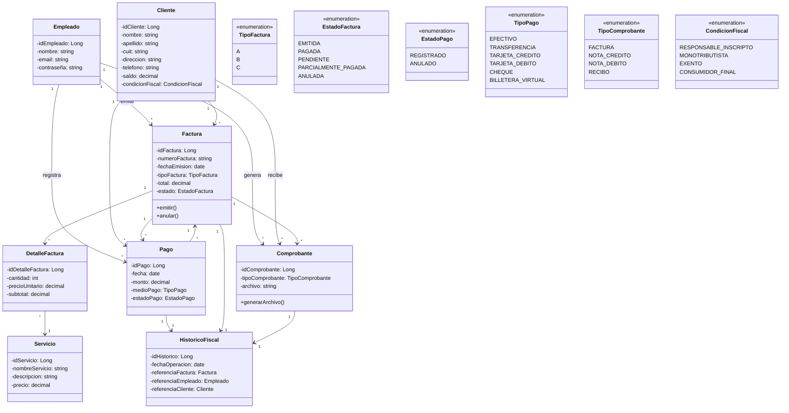
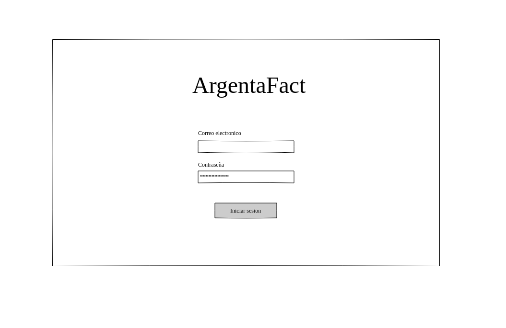
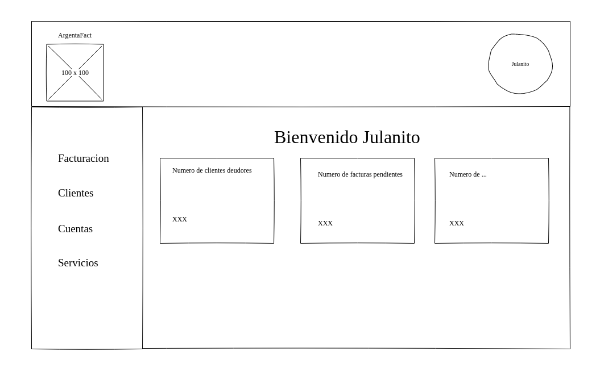
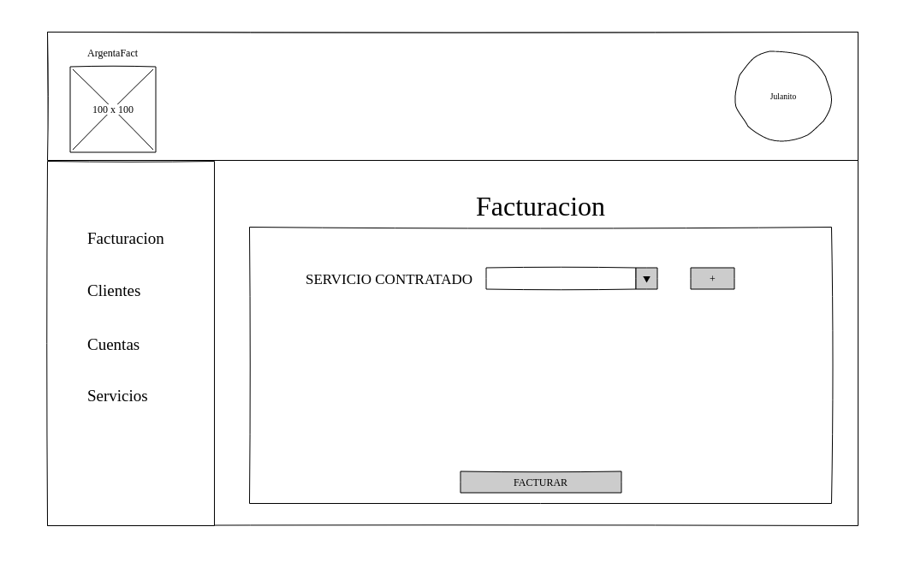
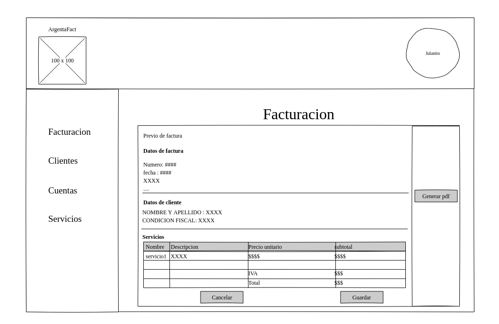
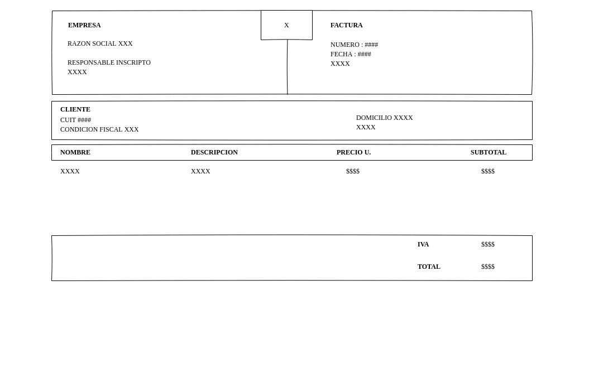
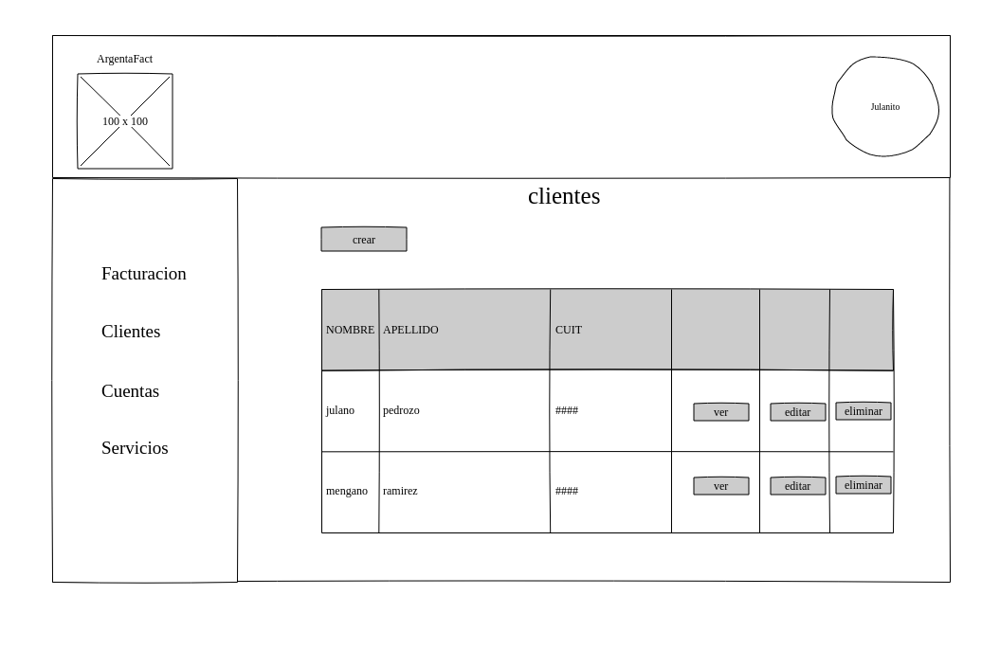
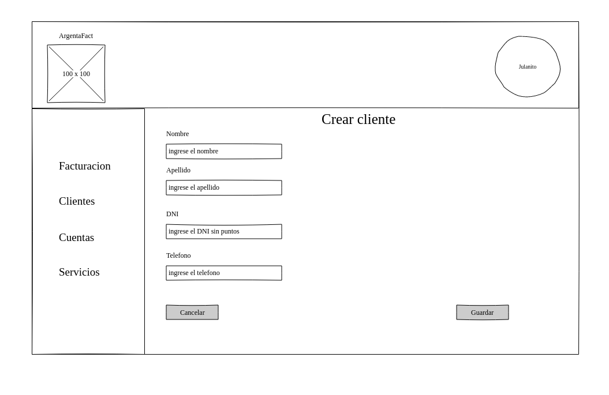

# Trabajo en equipo​
​
# Diseño OO​

# Wireframe y caso de uso​

## Inicio de sesion

## Dashboard

## Facturacion
### cargar factura

### preview factura

### formato pdf

## Gestion clientes
### Listar cliente

### Crear cliente

# Backlog de iteraciones​
​
# Tareas